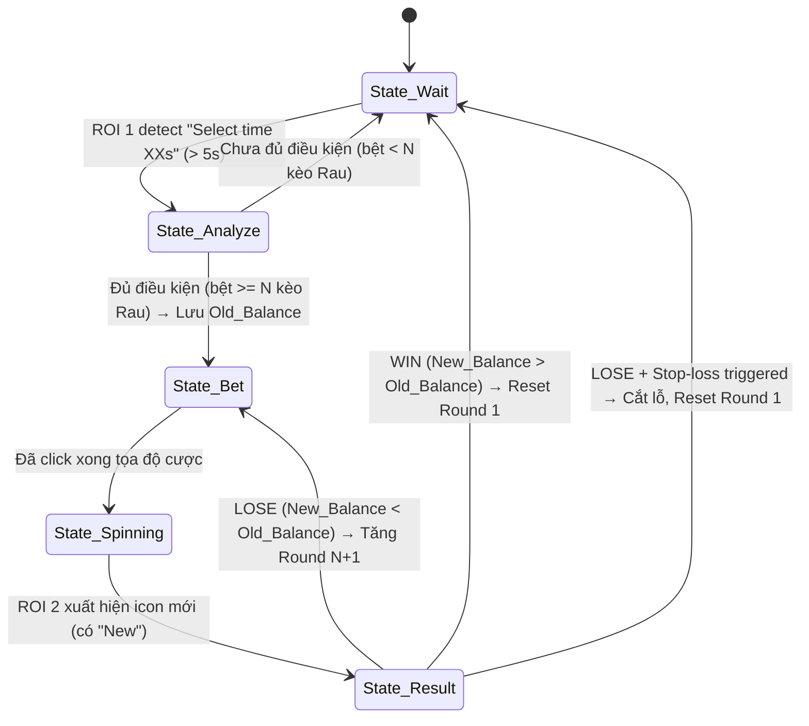

# Module AI Auto TOOL - Tài liệu Hệ thống Tự động hóa Greedy BIGO

> **Nguồn gốc:** Tổng hợp từ phiên brainstorm với AI - [Gemini Session](https://gemini.google.com/app/0ed9017ec567452c)

---

## Mục lục

1. [Tổng quan Game Greedy BIGO](#1-tổng-quan-game-greedy-bigo)
2. [Phân tích Tỷ lệ & Toán học Cơ bản](#2-phân-tích-tỷ-lệ--toán-học-cơ-bản)
3. [Hệ thống Chiến thuật Đặt cược](#3-hệ-thống-chiến-thuật-đặt-cược)
4. [Chiến thuật Rình mồi (Signal Waiting)](#4-chiến-thuật-rình-mồi-signal-waiting)
5. [Data Model chuẩn 11 trường](#5-data-model-chuẩn-11-trường)
6. [Kiến trúc Hệ thống (Architecture)](#6-kiến-trúc-hệ-thống-architecture)
7. [Đặc tả Nghiệp vụ Game (Business Logic)](#7-đặc-tả-nghiệp-vụ-game-business-logic)
8. [Critical Path & Tối ưu Hiệu năng](#8-critical-path--tối-ưu-hiệu-năng)
9. [Tính năng Data Mining & Thống kê](#9-tính-năng-data-mining--thống-kê)
10. [Dữ liệu Chiến thuật Mẫu (JSON)](#10-dữ-liệu-chiến-thuật-mẫu-json)
11. [Prompt Master cho AI Lập trình](#11-prompt-master-cho-ai-lập-trình)
12. [Kết nối Điện thoại Thật & Kiểm tra Laptop](#12-kết-nối-điện-thoại-thật--kiểm-tra-laptop)

---

## 1. Tổng quan Game Greedy BIGO

### Mô tả Game

**Greedy BIGO** là một mini-game kiểu vòng quay may mắn (Spin Wheel) trên nền tảng BIGO. Người chơi đặt cược xu (Kim Cương) vào các ô thực phẩm trên vòng quay, sau đó chờ kết quả quay.

### Giao diện Game

- **Vòng quay trung tâm:** Có đồng hồ đếm ngược "Select time XXs" (thời gian đặt cược)
- **8 ô thực phẩm** trên vòng quay chia làm 2 nhóm:
  - **Nhóm THỊT (4 loại):** Bò (Steak), Đùi gà (Chicken), Thịt xiên (Skewer), Xúc xích (Hotdog)
  - **Nhóm RAU (4 loại):** Cà chua (Tomato), Bắp cải (Cabbage), Ngô (Corn), Cà rốt (Carrot)
- **Khu vực chọn Chip:** Các nút `[10]`, `[50]`, `[100]`, `[1000]` ở dưới vòng quay
- **Dải lịch sử (Result History):** Nằm ở dưới cùng, hiển thị các icon kết quả, icon mới nhất có chữ "New"
- **Số dư Kim Cương:** Hiển thị ở góc dưới trái

### Hệ số nhân trả thưởng

| Loại thực phẩm | Hệ số nhân | Xác suất (ước lượng) |
|:---|:---:|:---|
| **Thịt bò (Steak)** | x45 | Rất thấp (khó trúng nhất) |
| **Đùi gà (Chicken)** | x25 | Thấp |
| **Thịt xiên (Skewer)** | x15 | Trung bình |
| **Xúc xích (Hotdog)** | x10 | Cao (dễ trúng nhất) |

> **Quy tắc vàng:** Cửa nào hệ số càng cao → xác suất xuất hiện càng thấp → đặt ít tiền hơn. Cửa nào dễ ra → đặt nhiều tiền hơn để "gánh lỗ" cho hệ thống.

### Quy tắc cược

- Mức cược tối thiểu (min) cho mỗi ô: **2 xu**
- Tất cả số lượng cược phải là **số chẵn** (bội số của 2)
- Mỗi vòng quay có thời gian đặt cược giới hạn (đếm ngược)
- Kết quả hiển thị trên dải lịch sử (Result History) sau mỗi vòng

---

## 2. Phân tích Tỷ lệ & Toán học Cơ bản

### Tỷ lệ đặt cược cơ sở (Ratio gốc)

Tỷ lệ tối ưu đã được tính toán: **1 Bò : 2 Gà : 3 Xiên : 5 Xúc xích**

Với mức cơ sở (1 bộ = 11 xu):
- Bò: 1 xu × 45 = 45 xu
- Gà: 2 xu × 25 = 50 xu
- Xiên: 3 xu × 15 = 45 xu
- Xúc xích: 5 xu × 10 = 50 xu

→ Tiền thắng dao động **45–50 xu**, sai lệch rất nhỏ → **Cào bằng rủi ro**.

### Mức đặt cược cơ sở thực tế

Với đơn vị tối thiểu 2 xu: **2 Bò - 4 Gà - 6 Xiên - 10 Xúc xích = 22 xu/kèo**

| Kết quả trúng | Tiền thắng | Tiền lãi ròng (trừ 22 xu vốn) |
|:---|:---:|:---:|
| Thịt bò (x45) | 2 × 45 = 90 xu | **68 xu** |
| Thịt xiên (x15) | 6 × 15 = 90 xu | **68 xu** |
| Đùi gà (x25) | 4 × 25 = 100 xu | **78 xu** |
| Xúc xích (x10) | 10 × 10 = 100 xu | **78 xu** |

> **Kết luận:**
> - Lãi tối thiểu (trúng Bò/Xiên): **68 xu**
> - Lãi tối đa (trúng Gà/Xúc xích): **78 xu**
> - Bò có hệ số cao nhất (x45) nhưng lãi thấp nhất vì đặt ít tiền nhất → Đây là **chiến lược Hedging** (bảo vệ rủi ro)

### Tại sao Bò (x45) lại lãi thấp nhất?

1. **Phân bổ vốn nghịch đảo với hệ số nhân:** Cửa hệ số cao → cược ít. Cửa hệ số thấp → cược nhiều → cào bằng lợi nhuận.
2. **Xác suất thực:** Bò xuất hiện rất ít trên vòng quay. Nếu đặt nhiều tiền vào Bò mà trúng Xúc xích → lỗ.
3. **Mục tiêu ổn định:** Biến trò chơi may rủi thành đầu tư lãi suất cố định (kèo nào cũng lãi ≥ 68 xu).

---

## 3. Hệ thống Chiến thuật Đặt cược

### Chiến thuật Martingale biến thể (Gấp thếp)

Nguyên lý: Khi thua, tăng tiền cược ở kèo tiếp theo sao cho khi thắng sẽ gỡ lại toàn bộ vốn đã thua + lãi mục tiêu.

### Bảng tổng hợp 6 Chiến thuật chính

| # | Tên chiến thuật | Lãi mục tiêu/kèo | Số vòng tối đa | Tổng vốn cần | Mô tả |
|:---:|:---|:---:|:---:|:---:|:---|
| 1 | **Sinh Tồn 3k** | 2 xu | 16 vòng | 3.300 xu | Giữ cược thấp, kéo dài sống sót |
| 2 | **Sinh Tồn 10k** | 2 xu | 20 vòng | 10.208 xu | Sinh Tồn 3k + 4 vòng gồng sâu |
| 3 | **An Toàn 3k** | 68 xu | 13 vòng | 3.234 xu | Cân bằng lãi và vốn |
| 4 | **An Toàn 10k** | 68 xu | 17 vòng | 10.142 xu | An Toàn 3k + 4 vòng gồng sâu |
| 5 | **Bạo Lực 3k** | 150 xu | 10 vòng | 3.124 xu | Lãi lớn, ít vòng chịu đựng |
| 6 | **Bạo Lực 10k** | 150 xu | 14 vòng | 9.966 xu | Bạo Lực 3k + 4 vòng gồng sâu |

### Chi tiết Chiến thuật 1: Sinh Tồn 3k (16 Vòng)

> Lãi tối thiểu mỗi kèo: **2 xu**. Ưu tiên giữ cược thấp nhất để kéo dài số vòng.

| Kèo | Bò | Gà | Xiên | Xúc xích | Tiền cược | Tổng vốn | Lãi thấp nhất |
|:---:|:---:|:---:|:---:|:---:|:---:|:---:|:---:|
| 1 | 2 | 4 | 6 | 10 | 22 | 22 | 68 |
| 2 | 2 | 4 | 6 | 10 | 22 | 44 | 46 |
| 3 | 2 | 4 | 6 | 10 | 22 | 66 | 24 |
| 4 | 2 | 4 | 6 | 10 | 22 | 88 | 2 |
| 5 | 4 | 8 | 12 | 20 | 44 | 132 | 48 |
| 6 | 4 | 8 | 12 | 20 | 44 | 176 | 4 |
| 7 | 6 | 12 | 18 | 30 | 66 | 242 | 28 |
| 8 | 8 | 16 | 24 | 40 | 88 | 330 | 30 |
| 9 | 10 | 20 | 30 | 50 | 110 | 440 | 10 |
| 10 | 14 | 28 | 42 | 70 | 154 | 594 | 36 |
| 11 | 18 | 36 | 54 | 90 | 198 | 792 | 18 |
| 12 | 24 | 48 | 72 | 120 | 264 | 1.056 | 24 |
| 13 | 32 | 64 | 96 | 160 | 352 | 1.408 | 32 |
| 14 | 42 | 84 | 126 | 210 | 462 | 1.870 | 20 |
| 15 | 56 | 112 | 168 | 280 | 616 | 2.486 | 34 |
| 16 | 74 | 148 | 222 | 370 | 814 | 3.300 | 30 |

**Cách hoạt động:**
- **Kèo 1–4:** Giữ nguyên mức cược min (22 xu). Không gấp thếp → tiết kiệm vốn.
- **Kèo 5+:** Nhích nhẹ số lượng lên dần để đảm bảo gỡ nợ kèo trước + có lãi.
- **Kèo 16 (Chốt):** Đánh 814 xu. Tổng vốn 3.300 xu. Nếu trúng → lãi 30 xu.

### Chi tiết Chiến thuật 3: An Toàn 3k (13 Vòng)

> Lãi mục tiêu: **68 xu/kèo**. Cân bằng giữa tỷ lệ ăn và vốn bỏ ra.

| Kèo | Bò | Gà | Xiên | Xúc xích | Tiền cược | Tổng vốn | Lãi thấp nhất |
|:---:|:---:|:---:|:---:|:---:|:---:|:---:|:---:|
| 1 | 2 | 4 | 6 | 10 | 22 | 22 | 68 |
| 2 | 4 | 8 | 12 | 20 | 44 | 66 | 114 |
| 3 | 4 | 8 | 12 | 20 | 44 | 110 | 70 |
| 4 | 6 | 12 | 18 | 30 | 66 | 176 | 94 |
| 5 | 8 | 16 | 24 | 40 | 88 | 264 | 96 |
| 6 | 10 | 20 | 30 | 50 | 110 | 374 | 76 |
| 7 | 14 | 28 | 42 | 70 | 154 | 528 | 102 |
| 8 | 18 | 36 | 54 | 90 | 198 | 726 | 84 |
| 9 | 24 | 48 | 72 | 120 | 264 | 990 | 90 |
| 10 | 32 | 64 | 96 | 160 | 352 | 1.342 | 98 |
| 11 | 42 | 84 | 126 | 210 | 462 | 1.804 | 86 |
| 12 | 56 | 112 | 168 | 280 | 616 | 2.420 | 100 |
| 13 | 74 | 148 | 222 | 370 | 814 | 3.234 | 96 |

### Mở rộng sang vốn 10k

Các chiến thuật 10k được mở rộng bằng cách thêm **4 vòng gồng sâu** vào cuối:

**Vòng mở rộng chung (thêm vào sau chiến thuật 3k tương ứng):**

| Vòng bổ sung | Bò | Gà | Xiên | Xúc xích | Tiền cược | Tổng vốn |
|:---:|:---:|:---:|:---:|:---:|:---:|:---:|
| +1 | 98 | 196 | 294 | 490 | 1.078 | +1.078 |
| +2 | 130 | 260 | 390 | 650 | 1.430 | +2.508 |
| +3 | 172 | 344 | 516 | 860 | 1.892 | +4.400 |
| +4 | 228 | 456 | 684 | 1.140 | 2.508 | +6.908 |

### Kịch bản thua dài (Stress Test)

**Nếu thua liên tiếp 50 kèo (chiến thuật An Toàn):**
- Tổng xu đã mất: **106.593.894 xu** (~106 triệu)
- Tiền cược kèo 51: **34.486.298 xu** (~34 triệu)
- Tổng vốn cần: **141.080.192 xu** (~141 triệu)
- Lãi tối đa nếu trúng Gà/Xúc xích ở kèo 51: **~15.675.708 xu** (~15 triệu)

### Kịch bản phục hồi sau cháy tài khoản

Nếu thua hết 16 kèo Sinh Tồn (mất 3.300 xu, còn 700 xu từ vốn 4k):
- Cần thắng **43–49 kèo** (tùy cửa trúng) ở mức cược 22 xu/kèo để gỡ lại.
- Trung bình thực tế: ~**45–46 kèo** thắng để về lại 4.000 xu.

---

## 4. Chiến thuật Rình mồi (Signal Waiting)

### Nguyên lý

> **"Không đánh khi chưa có tín hiệu."** — Đợi ra đủ N kèo Rau liên tiếp rồi mới bắt đầu đặt cược vào Thịt.

### Quy trình Rình mồi + Sinh Tồn (Win rate > 99%)

```
Bước 1 - RÌNH MỒI:
  → Ôm vốn, xem bảng lịch sử
  → Đếm số kèo Rau liên tiếp
  → TUYỆT ĐỐI không vào tiền cho đến khi đủ 8 kèo Rau liên tiếp

Bước 2 - XUỐNG TIỀN:
  → Bắt đầu đánh theo Bảng Chiến thuật (từ Kèo 1)
  → Nếu THẮNG → Quay lại Bước 1
  → Nếu THUA → Tăng lên Kèo N+1

Bước 3 - KỶ LUẬT:
  → Trúng ở bất kỳ lượt nào → NGAY LẬP TỨC quay lại Bước 1
  → TUYỆT ĐỐI không thừa thắng xông lên đánh liên tục
```

### Phân tích xác suất

- Với 8 kèo rình + 16 kèo đánh = **24 kèo Rau liên tiếp** để cháy tài khoản.
- Xác suất hệ thống không ra bất kỳ Thịt nào trong 24 vòng: **< 0.2%**.
- → Tỷ lệ thắng (về bờ): **> 99.8%**.

---

## 5. Data Model chuẩn 11 trường

Mỗi dòng dữ liệu chiến thuật gồm 11 trường:

```json
{
  "Round": 1,        // Số thứ tự kèo
  "Bo": 2,           // Số xu đặt vào Thịt bò
  "Ga": 4,           // Số xu đặt vào Đùi gà
  "Xien": 6,         // Số xu đặt vào Thịt xiên
  "Xuc": 10,         // Số xu đặt vào Xúc xích
  "Cost": 22,        // Tiền cược kèo này (Bo + Ga + Xien + Xuc)
  "TotalCost": 22,   // Tổng vốn lũy kế đã bỏ ra
  "ProfitBo": 68,    // Lãi ròng nếu trúng Bò (Bo*45 - TotalCost)
  "ProfitGa": 78,    // Lãi ròng nếu trúng Gà (Ga*25 - TotalCost)
  "ProfitXien": 68,  // Lãi ròng nếu trúng Xiên (Xien*15 - TotalCost)
  "ProfitXuc": 78    // Lãi ròng nếu trúng Xúc xích (Xuc*10 - TotalCost)
}
```

### Công thức tính

```
Cost         = Bo + Ga + Xien + Xuc
TotalCost(N) = TotalCost(N-1) + Cost(N)
ProfitBo     = Bo * 45 - TotalCost
ProfitGa     = Ga * 25 - TotalCost
ProfitXien   = Xien * 15 - TotalCost
ProfitXuc    = Xuc * 10 - TotalCost
```

---

## 6. Kiến trúc Hệ thống (Architecture)

### Tổng quan 2 Module

> **Hỗ trợ thiết bị:** Điện thoại Android thật (USB/WiFi ADB), Box Phone, hoặc Giả lập (BlueStacks/LDPlayer)

```
                    ┌─────────────────────┐
                    │  ANDROID DEVICE     │
                    │  (Phone / BoxPhone  │
                    │   / Emulator)       │
                    └──────────┬──────────┘
                               │
                      USB Cable / WiFi ADB
                      (adb connect IP:PORT)
                               │
┌──────────────────────────────┼──────────────────────────────┐
│                        LAPTOP / PC                          │
│                                                             │
│  ┌─────────────────────────────┐                            │
│  │       .NET 8 WPF            │                            │
│  │    CONTROL PLANE             │                            │
│  │                             │                            │
│  │  • Device Management        │                            │
│  │  • Config & Strategy Import │                            │
│  │  • Data Mining (SQLite)     │                            │
│  │  • Analytics Dashboard      │                            │
│  │  • Monitoring & Logging     │                            │
│  └─────────────┬───────────────┘                            │
│                │                                            │
│          IPC / Shared Memory                                │
│          (Memory Mapped Files)                              │
│                │                                            │
│  ╔═════════════╧═══════════════╗                            │
│  ║     C++ REALTIME CORE       ║                            │
│  ║                             ║                            │
│  ║  • Fast Capture (scrcpy)    ║                            │
│  ║  • Frame Diff               ║                            │
│  ║  • GPU Vision (YOLO + OCR)  ║                            │
│  ║  • State Engine             ║                            │
│  ║  • Action Planner           ║                            │
│  ║  • ADB Queue (minitouch)    ║                            │
│  ╚═════════════════════════════╝                            │
│                                                             │
└─────────────────────────────────────────────────────────────┘
```

### Chế độ kết nối thiết bị

| Chế độ | Lệnh ADB | Yêu cầu | Độ trễ |
|:---|:---|:---|:---:|
| **USB Cable** | `adb devices` | Cáp USB + Bật USB Debugging | **Thấp nhất (~2ms)** |
| **WiFi ADB** | `adb connect <IP>:<PORT>` | Android 11+, cùng mạng WiFi | Trung bình (~10-50ms) |
| **Giả lập** | `adb connect 127.0.0.1:<PORT>` | BlueStacks/LDPlayer | Thấp (~5ms) |

### Critical Path (Luồng xử lý chính)

```
PHONE → CAPTURE → RAM → FRAME DIFF → GPU VISION → STATE ENGINE → ACTION PLANNER → ADB QUEUE → PHONE
                                                                                        ↓
                                                                                    VERIFY → LOOP
```

### Cấu trúc Solution

```
Solution/
├── ControlPlane/              (.NET 8 WPF)
│   ├── Domain/
│   │   ├── Entities/          (StreakLog, StrategyRound)
│   │   └── Interfaces/        (IStreakRepository, IOcrService)
│   ├── Application/
│   │   └── Services/          (GameLoop, Analytics UseCases)
│   ├── Infrastructure/
│   │   ├── SQLiteRepository   (Dapper / EF Core SQLite)
│   │   ├── AdbController
│   │   └── TesseractOcrProcessor
│   └── Presentation/
│       ├── Views/             (WPF XAML)
│       └── ViewModels/        (MVVM pattern)
│
├── RealtimeCore/              (C++ DLL)
│   ├── Capture/               (FastCapture - scrcpy protocol)
│   ├── Vision/                (YOLO TensorRT + OCR)
│   ├── Engine/                (State Machine)
│   ├── Planner/               (Action Planner + Validator)
│   └── ADB/                   (minitouch / /dev/input/eventX)
│
├── config.json                (Tọa độ ROI, tọa độ click, chiến thuật)
├── strategies/                (JSON files cho các chiến thuật)
└── CMakeLists.txt
```

### Design Patterns áp dụng

- **MVVM** cho WPF UI
- **Clean Architecture** (Domain → Application → Infrastructure → Presentation)
- **Repository Pattern** cho SQLite
- **State Machine Pattern** cho Game Loop
- **IPC / Shared Memory** cho liên lạc C# ↔ C++

---

## 7. Đặc tả Nghiệp vụ Game (Business Logic)

### 7.1 Computer Vision - Các vùng ROI cần quét

#### ROI 1: Đồng hồ đếm ngược (Center Box)

- **Vị trí:** Nằm giữa vòng quay
- **Nội dung:** Chữ "Select time XXs"
- **Phương pháp:** OCR (Tesseract/PaddleOCR)
- **Nghiệp vụ:**
  - Đọc được số > 2s → Trạng thái `[BETTING]` (đang mở cược)
  - Chữ mờ đi / hết giờ → Trạng thái `[SPINNING]` (đang quay)

#### ROI 2: Dải kết quả lịch sử (Bottom Bar)

- **Vị trí:** Cạnh chữ "Result" ở dưới cùng
- **Nội dung:** Các icon xếp hàng ngang, icon mới nhất có chữ "New"
- **Phương pháp:** YOLOv8 hoặc Template Matching (**KHÔNG dùng OCR**)
- **8 loại Icon cần nhận diện:**

| Nhóm | Icon 1 | Icon 2 | Icon 3 | Icon 4 |
|:---|:---|:---|:---|:---|
| **RAU** | Tomato | Cabbage | Corn | Carrot |
| **THỊT** | Hotdog | Skewer | Chicken | Steak |

- **Mục đích:** Đếm số icon RAU xuất hiện liên tiếp từ trái qua phải

#### ROI 3: Số dư Kim Cương (Bottom Left)

- **Vị trí:** Ô "Số dư Kim Cương X >"
- **Phương pháp:** OCR (Tesseract/PaddleOCR)
- **Nghiệp vụ:** Chỉ đọc **2 lần** trong 1 vòng lặp:
  - `Before_Spin`: Lúc bắt đầu vòng mới
  - `After_Spin`: Lúc vòng quay kết thúc, dải lịch sử vừa update

#### ROI 4: Khu vực chọn Chip (Wager)

- **Vị trí:** Nằm dưới vòng quay
- **Nội dung:** Các nút chip `[10]`, `[50]`, `[100]`, `[1000]`

#### ROI 5: Khu vực đặt cược (Trên Vòng Quay)

- **Vị trí:** Tọa độ của 4 ô Thịt trên vòng quay
- **Nội dung:** Bò (x45), Gà (x25), Xiên (x15), Xúc xích (x10)

### 7.2 State Machine (Vòng lặp Trạng thái)



### Chi tiết từng State

#### `State_Wait`
- Quét ROI 1 (Đồng hồ)
- Đợi đến khi xuất hiện "Select time XXs" (XX > 5s)
- → Chuyển sang `State_Analyze`

#### `State_Analyze`
- Quét ROI 2 (History) → Đếm số RAU bệt liên tiếp
- Gửi log độ dài bệt về .NET để lưu Data Mining
- So sánh với config Trigger (VD: bệt >= 8 Rau)
- Nếu **CHƯA** đủ điều kiện → Bỏ qua, quay lại `State_Wait`
- Nếu **ĐỦ** điều kiện → Quét ROI 3 lưu `Old_Balance` → `State_Bet`

#### `State_Bet` (Action Planner)
- Đọc mảng cấu hình Strategy (Round thứ N) từ .NET
- **Thuật toán Click:** Tính toán số lần Tap dựa trên Chip
  ```
  VD: Cần cược 22 xu cho Bò (2 xu)
  → Bấm chọn Chip [10] → Chưa có Chip 1 xu nên...
  → Hoặc sử dụng Chip nhỏ nhất phù hợp
  ```
- Thực thi chuỗi thao tác qua ADB Input Queue (Fast socket)
- → `State_Spinning`

#### `State_Spinning`
- Đợi cho đến khi ROI 2 (History) xuất hiện sự thay đổi (Icon mới nhảy vào)
- → `State_Result`

#### `State_Result`
- Quét lại ROI 3 lấy `New_Balance`
- **So sánh:**
  - `New_Balance > Old_Balance` → **WIN** → Reset vòng lặp chiến thuật về Round 1 → `State_Wait`
  - `New_Balance < Old_Balance` → **LOSE** → Tăng lên Round N+1
    - Kiểm tra Stop-loss: `TotalCost(N+1) > Ngân sách` → Cắt lỗ, reset → `State_Wait`
    - Nếu OK → Quay lại `State_Bet` với Round mới

---

## 8. Critical Path & Tối ưu Hiệu năng

### Các yêu cầu BẮT BUỘC

#### 1. FAST CAPTURE

> ❌ **TUYỆT ĐỐI KHÔNG** dùng `adb shell screencap` (quá chậm do overhead encode PNG)

✅ Phải dùng thư viện raw stream (như lõi của **scrcpy** hoặc **minicap**) để đẩy luồng h.264/raw pixel thẳng vào RAM máy tính qua socket ADB forward.

#### 2. IPC (Zero-Copy)

Sử dụng **Memory Mapped Files** (Shared Memory) để:
- Truyền dữ liệu cấu hình từ .NET xuống C++
- Truyền log từ C++ lên .NET
- Không copy frame dư thừa

#### 3. FRAME DIFF (Motion Detection)

- So sánh byte ảnh hoặc hash ảnh trên CPU/GPU cực nhẹ
- Chỉ khi frame có sự thay đổi (animation vòng quay dừng, số dư cập nhật) → đẩy sang GPU Vision (`YES`)
- Nếu không đổi (`NO`) → bỏ qua → **tiết kiệm tới 80% tài nguyên GPU**

#### 4. GPU VISION

- **YOLO:** Trọng số hóa model YOLOv8 Nano (dạng `.engine` TensorRT) để detect Rau/Thịt
- **OCR:** Dùng Tesseract C++ API hoặc PaddleOCR (GPU version) - khoanh vùng chính xác ROI

#### 5. ADB QUEUE (Click/Tap)

> ❌ **TUYỆT ĐỐI KHÔNG** dùng `adb shell input tap` (độ trễ tạo process > 100ms)

✅ Phải dùng giao thức truyền trực tiếp event:
- `/dev/input/eventX`
- Socket của **minitouch** / scrcpy protocol
- Độ trễ click: **< 5ms**

---

## 9. Tính năng Data Mining & Thống kê

### Chế độ hoạt động

| Mode | Tên | Mô tả |
|:---:|:---|:---|
| 1 | **Auto Betting** | Quét màn hình, rình mồi và tự động vào lệnh theo chiến thuật |
| 2 | **Data Mining** | Chỉ đọc OCR, ghi nhận lịch sử Rau/Thịt vào SQLite. Không click. |

### Analytics Dashboard

- **Biểu đồ phân phối chuỗi bệt Rau:**
  - Trục X: Độ dài chuỗi bệt (4, 5, 8, 12...)
  - Trục Y: Số lần xuất hiện
- **Bộ lọc truy vấn:**
  - Thống kê theo **ngày** (Daily)
  - Thống kê theo **khung giờ** trong ngày (Hourly Distribution)
  - Thống kê theo **tuần** (Weekly)
- **Thư viện đồ thị:** LiveCharts2 hoặc ScottPlot

### Database Schema (SQLite)

```sql
CREATE TABLE StreakLog (
    Id INTEGER PRIMARY KEY AUTOINCREMENT,
    StreakLength INTEGER NOT NULL,      -- Độ dài chuỗi bệt Rau
    StreakType TEXT NOT NULL,            -- 'RAU' hoặc 'THIT'
    StartTime DATETIME NOT NULL,
    EndTime DATETIME NOT NULL,
    DayOfWeek INTEGER,
    HourSlot INTEGER                    -- Khung giờ (0-23)
);

CREATE TABLE BetLog (
    Id INTEGER PRIMARY KEY AUTOINCREMENT,
    StrategyName TEXT,
    RoundNumber INTEGER,
    BetAmount INTEGER,
    TotalCostSoFar INTEGER,
    Result TEXT,                         -- 'WIN' hoặc 'LOSE'
    BalanceBefore INTEGER,
    BalanceAfter INTEGER,
    ProfitLoss INTEGER,
    Timestamp DATETIME DEFAULT CURRENT_TIMESTAMP
);
```

### Giao diện WPF Control Panel

```
┌──────────────────────────────────────────────┐
│  🎮 Greedy BIGO Auto Tool                    │
├──────────────────────────────────────────────┤
│  [Dropdown: Chọn Chiến thuật ▼]              │
│  [TextBox: Số kèo rình mồi: 8      ]        │
│  [TextBox: Stop-loss (xu):  3300    ]        │
│  [Checkbox: ☑ Hẹn giờ] [08:00] → [11:30]    │
│                                              │
│  [🟢 START]  [🔴 STOP]  [Mode: Auto/Mining]  │
├──────────────────────────────────────────────┤
│  📊 LOG REALTIME                             │
│  [10:15:32] Số dư: 4000 | Bệt: 5 | Rình mồi│
│  [10:16:01] Số dư: 4000 | Bệt: 8 | VÀO LỆNH│
│  [10:16:15] Kèo 1: Đặt 22xu | KQ: WIN +68xu │
│  [10:16:20] Reset → Rình mồi                │
├──────────────────────────────────────────────┤
│  📈 BIỂU ĐỒ THỐNG KÊ                       │
│  [Chart: Phân phối chuỗi bệt Rau]           │
└──────────────────────────────────────────────┘
```

---

## 10. Dữ liệu Chiến thuật Mẫu (JSON)

### Chiến thuật Sinh Tồn 19 Vòng (Tối ưu cho Vốn 12.000 xu)

```json
[
  {"Round": 1, "Bo": 2, "Ga": 4, "Xien": 6, "Xuc": 10, "Cost": 22, "TotalCost": 22, "ProfitBo": 68, "ProfitGa": 78, "ProfitXien": 68, "ProfitXuc": 78},
  {"Round": 2, "Bo": 2, "Ga": 4, "Xien": 6, "Xuc": 10, "Cost": 22, "TotalCost": 44, "ProfitBo": 46, "ProfitGa": 56, "ProfitXien": 46, "ProfitXuc": 56},
  {"Round": 3, "Bo": 2, "Ga": 4, "Xien": 6, "Xuc": 10, "Cost": 22, "TotalCost": 66, "ProfitBo": 24, "ProfitGa": 34, "ProfitXien": 24, "ProfitXuc": 34},
  {"Round": 4, "Bo": 4, "Ga": 8, "Xien": 12, "Xuc": 20, "Cost": 44, "TotalCost": 110, "ProfitBo": 70, "ProfitGa": 90, "ProfitXien": 70, "ProfitXuc": 90},
  {"Round": 5, "Bo": 4, "Ga": 8, "Xien": 12, "Xuc": 20, "Cost": 44, "TotalCost": 154, "ProfitBo": 26, "ProfitGa": 46, "ProfitXien": 26, "ProfitXuc": 46},
  {"Round": 6, "Bo": 6, "Ga": 12, "Xien": 18, "Xuc": 30, "Cost": 66, "TotalCost": 220, "ProfitBo": 50, "ProfitGa": 80, "ProfitXien": 50, "ProfitXuc": 80},
  {"Round": 7, "Bo": 8, "Ga": 16, "Xien": 24, "Xuc": 40, "Cost": 88, "TotalCost": 308, "ProfitBo": 52, "ProfitGa": 92, "ProfitXien": 52, "ProfitXuc": 92},
  {"Round": 8, "Bo": 10, "Ga": 20, "Xien": 30, "Xuc": 50, "Cost": 110, "TotalCost": 418, "ProfitBo": 32, "ProfitGa": 82, "ProfitXien": 32, "ProfitXuc": 82},
  {"Round": 9, "Bo": 14, "Ga": 28, "Xien": 42, "Xuc": 70, "Cost": 154, "TotalCost": 572, "ProfitBo": 58, "ProfitGa": 128, "ProfitXien": 58, "ProfitXuc": 128},
  {"Round": 10, "Bo": 18, "Ga": 36, "Xien": 54, "Xuc": 90, "Cost": 198, "TotalCost": 770, "ProfitBo": 40, "ProfitGa": 130, "ProfitXien": 40, "ProfitXuc": 130},
  {"Round": 11, "Bo": 24, "Ga": 48, "Xien": 72, "Xuc": 120, "Cost": 264, "TotalCost": 1034, "ProfitBo": 46, "ProfitGa": 166, "ProfitXien": 46, "ProfitXuc": 166},
  {"Round": 12, "Bo": 32, "Ga": 64, "Xien": 96, "Xuc": 160, "Cost": 352, "TotalCost": 1386, "ProfitBo": 54, "ProfitGa": 214, "ProfitXien": 54, "ProfitXuc": 214},
  {"Round": 13, "Bo": 42, "Ga": 84, "Xien": 126, "Xuc": 210, "Cost": 462, "TotalCost": 1848, "ProfitBo": 42, "ProfitGa": 252, "ProfitXien": 42, "ProfitXuc": 252},
  {"Round": 14, "Bo": 56, "Ga": 112, "Xien": 168, "Xuc": 280, "Cost": 616, "TotalCost": 2464, "ProfitBo": 56, "ProfitGa": 336, "ProfitXien": 56, "ProfitXuc": 336},
  {"Round": 15, "Bo": 74, "Ga": 148, "Xien": 222, "Xuc": 370, "Cost": 814, "TotalCost": 3278, "ProfitBo": 52, "ProfitGa": 422, "ProfitXien": 52, "ProfitXuc": 422},
  {"Round": 16, "Bo": 98, "Ga": 196, "Xien": 294, "Xuc": 490, "Cost": 1078, "TotalCost": 4356, "ProfitBo": 54, "ProfitGa": 544, "ProfitXien": 54, "ProfitXuc": 544},
  {"Round": 17, "Bo": 130, "Ga": 260, "Xien": 390, "Xuc": 650, "Cost": 1430, "TotalCost": 5786, "ProfitBo": 64, "ProfitGa": 714, "ProfitXien": 64, "ProfitXuc": 714},
  {"Round": 18, "Bo": 172, "Ga": 344, "Xien": 516, "Xuc": 860, "Cost": 1892, "TotalCost": 7678, "ProfitBo": 62, "ProfitGa": 922, "ProfitXien": 62, "ProfitXuc": 922},
  {"Round": 19, "Bo": 228, "Ga": 456, "Xien": 684, "Xuc": 1140, "Cost": 2508, "TotalCost": 10186, "ProfitBo": 74, "ProfitGa": 1214, "ProfitXien": 74, "ProfitXuc": 1214}
]
```

---

## 11. Prompt Master cho AI Lập trình

### Prompt hoàn chỉnh (Copy toàn bộ nội dung bên dưới)

---

**Vai trò của bạn:** Bạn là một Principal Software Architect và High-Performance Systems Engineer.

**Nhiệm vụ:** Viết mã nguồn cho hệ thống tự động hóa mini-game "Greedy BIGO" trên thiết bị Android (Điện thoại thật qua USB/WiFi ADB, Box Phone, hoặc Giả lập). Hệ thống chia làm 2 module: **Control Plane (.NET 8 WPF)** và **Realtime Core (C++)** kết nối qua IPC (Shared Memory). Hệ thống phải tự động detect thiết bị kết nối qua ADB và hỗ trợ cả chế độ USB lẫn WiFi ADB. Bạn phải bám sát 100% vào Đặc tả nghiệp vụ (Business Logic) dưới đây để xây dựng State Machine.

**1. ĐẶC TẢ NGHIỆP VỤ & STATE MACHINE (YÊU CẦU BẮT BUỘC)**

- **Computer Vision ROIs:**
  - **ROI 1 (Đồng hồ):** Dùng OCR đọc "Select time XXs".
  - **ROI 2 (Lịch sử kết quả):** Dùng YOLOv8/Template Matching detect 8 loại Icon (Nhóm Rau và Nhóm Thịt). Quét liên tục để đếm số icon Rau bệt liên tiếp.
  - **ROI 3 (Số dư Kim Cương):** Dùng OCR đọc Balance (Chỉ đọc Before_Spin và After_Spin).
  - **ROI 4 & 5 (Khu vực cược):** Tọa độ các Chip và 4 ô Thịt.

- **Game State Engine (C++):**
  - **State_Wait:** Quét ROI 1. Đợi xuất hiện "Select time XXs" (> 5s).
  - **State_Analyze:** Đếm số RAU bệt (ROI 2). Gửi log về .NET. Nếu đủ điều kiện >= Target → Lưu `Old_Balance`, chuyển State_Bet. Nếu chưa đủ → State_Wait.
  - **State_Bet (Action Planner):** Đọc Strategy từ .NET. Tính toán tọa độ và số lần Tap vào chip, vào ô cược. Thực thi qua ADB.
  - **State_Spinning:** Đợi ROI 2 xuất hiện icon mới (có chữ "New").
  - **State_Result:** Quét ROI 3 lấy `New_Balance`. Nếu New > Old (WIN) → Reset vòng lặp. Nếu New < Old (LOSE) → Tăng vòng lặp (gấp thếp). Check Stop-loss để cắt lỗ nếu cần.

**2. KIẾN TRÚC KỸ THUẬT (CRITICAL PATH)**

- **FAST CAPTURE:** Phải dùng raw stream (như lõi của `scrcpy` hoặc `minicap`), KHÔNG dùng `adb shell screencap`.
- **IPC (Zero-Copy):** Sử dụng Memory Mapped Files truyền cấu hình Kèo và Log giữa C# và C++.
- **ADB QUEUE:** Dùng giao thức `minitouch` hoặc `/dev/input/eventX`. KHÔNG dùng `adb shell input tap`.

**3. PHẦN .NET CONTROL PLANE & DATA MINING**

- **WPF UI:** Xây dựng Dashboard điều khiển (MVVM). Nhập/Xuất cấu hình JSON 11 trường thông tin Kèo.
- **Data Mining (SQLite):** .NET nhận tín hiệu độ dài chuỗi "Rau" từ C++ và ghi vào SQLite sử dụng Entity Framework Core/Dapper. Vẽ biểu đồ bằng LiveCharts2.

**Yêu cầu đầu ra:**
1. Khởi tạo cấu trúc Solution (WPF C# và DLL C++). Viết CMakeLists.txt.
2. Viết Core C++ (Capture, FrameDiff, YOLO/OCR integration, StateMachine).
3. Viết C# IPC Layer, Database SQLite và ViewModel WPF.

---

## Phụ lục: Các NuGet Packages / Dependencies cần thiết

### .NET 8 (C# WPF)

| Package | Mục đích |
|:---|:---|
| `Tesseract` (Tesseract.NET) | OCR đọc chữ trên màn hình |
| `OpenCvSharp4` / `EmguCV` | Xử lý ảnh |
| `LiveCharts2` / `ScottPlot` | Vẽ biểu đồ thống kê |
| `Microsoft.EntityFrameworkCore.Sqlite` | Database SQLite |
| `Dapper` | Lightweight ORM |
| `CommunityToolkit.Mvvm` | MVVM Toolkit |
| `MediatR` | Messenger pattern |

### C++ (Realtime Core)

| Library | Mục đích |
|:---|:---|
| `OpenCV` (build with CUDA) | Xử lý ảnh GPU |
| `TensorRT` | Inference YOLO model |
| `Tesseract C++ API` / `PaddleOCR` | OCR đọc số dư |
| `scrcpy lib` / `minicap` | Fast screen capture |
| `minitouch` | Fast ADB touch events |

---

## 12. Kết nối Điện thoại Thật & Kiểm tra Laptop

### 12.1 Thiết lập Điện thoại Android

#### Bước 1: Bật Developer Options

```
Cài đặt → Giới thiệu về điện thoại → Bấm 7 lần vào "Số bản dựng" (Build Number)
→ Thông báo "Bạn đã là nhà phát triển" xuất hiện
```

#### Bước 2: Bật USB Debugging

```
Cài đặt → Tùy chọn nhà phát triển (Developer Options)
  ☑ Bật "Gỡ lỗi USB" (USB Debugging)
  ☑ Bật "Không khóa màn hình khi sạc" (Stay Awake) ← QUAN TRỌNG khi treo máy
```

#### Bước 3: Kết nối USB và xác nhận

```bash
# Cắm cáp USB vào laptop
# Trên điện thoại sẽ hiện popup "Cho phép gỡ lỗi USB?" → Bấm "Cho phép" + tick "Luôn cho phép"

# Trên laptop, mở terminal:
adb devices

# Kết quả mong đợi:
# List of devices attached
# XXXXXXXX    device       ← OK, đã kết nối thành công
```

#### Bước 4 (Tùy chọn): Chuyển sang WiFi ADB (không cần cáp)

> Yêu cầu: Android 11+ và điện thoại cùng mạng WiFi với laptop.

```bash
# Cách 1: Wireless Debugging (Android 11+)
# Trên điện thoại: Cài đặt → Tùy chọn nhà phát triển → Bật "Gỡ lỗi không dây" (Wireless Debugging)
# Bấm "Ghép nối thiết bị bằng mã ghép nối" → Ghi nhớ IP:PORT và Mã ghép nối

adb pair <IP>:<PAIR_PORT>    # Nhập mã ghép nối khi được hỏi
adb connect <IP>:<PORT>       # Kết nối
adb devices                   # Kiểm tra

# Cách 2: ADB qua TCP/IP (cần cắm USB 1 lần đầu)
adb tcpip 5555
adb connect <IP_DIEN_THOAI>:5555
# Rút cáp USB → Vẫn kết nối qua WiFi
```

### 12.2 Yêu cầu Phần cứng Laptop

| Thành phần | Yêu cầu Tối thiểu | Khuyến nghị | Mục đích |
|:---|:---|:---|:---|
| **CPU** | Intel i5 Gen 8+ / Ryzen 5 3000+ | Intel i7 / Ryzen 7 | Xử lý OCR, Frame Diff |
| **RAM** | 8 GB | 16 GB | Chạy .NET + C++ Core + SQLite |
| **GPU** | Không bắt buộc (CPU mode) | NVIDIA GTX 1050+ (CUDA) | Tăng tốc YOLO inference |
| **Ổ cứng** | SSD 256 GB | SSD 512 GB | Tốc độ đọc/ghi SQLite, log |
| **USB** | USB 2.0 | USB 3.0 | Tốc độ truyền frame qua ADB |
| **Mạng** | WiFi 2.4 GHz | WiFi 5 GHz (cùng mạng) | Cho WiFi ADB mode |
| **OS** | Windows 10 64-bit | Windows 11 | .NET 8, ADB drivers |

### 12.3 Phần mềm cần cài đặt trước

| Phần mềm | Mục đích | Link tải |
|:---|:---|:---|
| **.NET 8 SDK** | Chạy Control Plane WPF | https://dotnet.microsoft.com/download/dotnet/8.0 |
| **ADB (Platform Tools)** | Giao tiếp với điện thoại | https://developer.android.com/tools/releases/platform-tools |
| **scrcpy** | Fast screen capture + mirror | https://github.com/Genymobile/scrcpy |
| **Visual Studio 2022** | Build C# + C++ project | https://visualstudio.microsoft.com |
| **Python 3.10+** (tùy chọn) | Script kiểm tra nhanh | https://python.org |
| **Tesseract OCR** | Engine OCR | https://github.com/tesseract-ocr/tesseract |

### 12.4 Script Kiểm tra Hệ thống (Chạy trên Laptop)

Tạo file `check_system.py` để kiểm tra laptop có đáp ứng được yêu cầu không:

```python
"""
Script kiểm tra hệ thống trước khi triển khai ToolAutoXalat.
Chạy: python check_system.py
"""
import subprocess
import shutil
import platform
import os
import sys

def print_header(title):
    print(f"\n{'='*60}")
    print(f"  {title}")
    print(f"{'='*60}")

def check_pass(name, ok, detail=""):
    status = "✅ PASS" if ok else "❌ FAIL"
    print(f"  {status}  {name}" + (f" → {detail}" if detail else ""))
    return ok

def main():
    results = []
    print_header("KIỂM TRA HỆ THỐNG - ToolAutoXalat")
    print(f"  OS: {platform.system()} {platform.release()}")
    print(f"  Architecture: {platform.machine()}")

    # 1. Check ADB
    print_header("1. ADB (Android Debug Bridge)")
    adb_path = shutil.which("adb")
    results.append(check_pass("ADB đã cài đặt", adb_path is not None, adb_path or "Chưa cài. Tải tại: developer.android.com/tools/releases/platform-tools"))

    if adb_path:
        try:
            r = subprocess.run(["adb", "devices"], capture_output=True, text=True, timeout=10)
            lines = [l for l in r.stdout.strip().split("\n") if "\tdevice" in l]
            results.append(check_pass(f"Thiết bị kết nối: {len(lines)} device(s)", len(lines) > 0, 
                           ", ".join([l.split("\t")[0] for l in lines]) if lines else "Không có thiết bị. Cắm USB + bật USB Debugging"))
            
            if lines:
                device_id = lines[0].split("\t")[0]
                # Check resolution
                r2 = subprocess.run(["adb", "-s", device_id, "shell", "wm", "size"], capture_output=True, text=True, timeout=5)
                results.append(check_pass("Độ phân giải màn hình", True, r2.stdout.strip()))
                
                # Check Android version
                r3 = subprocess.run(["adb", "-s", device_id, "shell", "getprop", "ro.build.version.release"], capture_output=True, text=True, timeout=5)
                android_ver = r3.stdout.strip()
                results.append(check_pass(f"Android version", True, f"Android {android_ver}"))
                
                # Check screencap speed
                import time
                start = time.time()
                subprocess.run(["adb", "-s", device_id, "shell", "screencap", "-p", "/dev/null"], capture_output=True, timeout=10)
                elapsed = (time.time() - start) * 1000
                results.append(check_pass(f"Tốc độ screencap", elapsed < 500, f"{elapsed:.0f}ms (< 500ms là OK, scrcpy sẽ nhanh hơn nhiều)"))

        except subprocess.TimeoutExpired:
            results.append(check_pass("ADB phản hồi", False, "Timeout - kiểm tra lại kết nối"))
        except Exception as e:
            results.append(check_pass("ADB hoạt động", False, str(e)))

    # 2. Check scrcpy
    print_header("2. SCRCPY (Fast Screen Capture)")
    scrcpy_path = shutil.which("scrcpy")
    results.append(check_pass("scrcpy đã cài đặt", scrcpy_path is not None, scrcpy_path or "Chưa cài. Tải tại: github.com/Genymobile/scrcpy"))

    # 3. Check .NET
    print_header("3. .NET SDK")
    dotnet_path = shutil.which("dotnet")
    results.append(check_pass(".NET SDK đã cài", dotnet_path is not None, dotnet_path or "Chưa cài. Tải tại: dotnet.microsoft.com"))
    if dotnet_path:
        try:
            r = subprocess.run(["dotnet", "--version"], capture_output=True, text=True, timeout=5)
            ver = r.stdout.strip()
            is_net8 = ver.startswith("8.") or int(ver.split(".")[0]) >= 8
            results.append(check_pass(f".NET version >= 8.0", is_net8, f"v{ver}"))
        except:
            pass

    # 4. Check Python + Tesseract
    print_header("4. PYTHON & OCR")
    results.append(check_pass(f"Python version", True, f"{sys.version.split()[0]}"))
    
    tess_path = shutil.which("tesseract")
    results.append(check_pass("Tesseract OCR đã cài", tess_path is not None, tess_path or "Chưa cài (tùy chọn, có thể dùng PaddleOCR)"))

    # 5. Check GPU (NVIDIA)
    print_header("5. GPU (NVIDIA CUDA - Tùy chọn)")
    nvidia_smi = shutil.which("nvidia-smi")
    if nvidia_smi:
        try:
            r = subprocess.run(["nvidia-smi", "--query-gpu=name,memory.total,driver_version", "--format=csv,noheader"], 
                             capture_output=True, text=True, timeout=5)
            gpu_info = r.stdout.strip()
            results.append(check_pass("NVIDIA GPU", True, gpu_info))
        except:
            results.append(check_pass("NVIDIA GPU", False, "nvidia-smi lỗi"))
    else:
        results.append(check_pass("NVIDIA GPU", False, "Không có GPU NVIDIA (Tool vẫn chạy được ở CPU mode, chậm hơn ~3x)"))

    # 6. System resources
    print_header("6. TÀI NGUYÊN HỆ THỐNG")
    try:
        import psutil
        ram_gb = psutil.virtual_memory().total / (1024**3)
        cpu_count = psutil.cpu_count()
        results.append(check_pass(f"RAM >= 8GB", ram_gb >= 8, f"{ram_gb:.1f} GB"))
        results.append(check_pass(f"CPU cores >= 4", cpu_count >= 4, f"{cpu_count} cores"))
    except ImportError:
        print("  ⚠️  Cài 'pip install psutil' để kiểm tra RAM/CPU chi tiết")
        # Fallback: dùng systeminfo trên Windows
        if platform.system() == "Windows":
            try:
                r = subprocess.run(["wmic", "OS", "get", "TotalVisibleMemorySize", "/value"], capture_output=True, text=True, timeout=10)
                for line in r.stdout.split("\n"):
                    if "TotalVisibleMemorySize" in line:
                        ram_kb = int(line.split("=")[1].strip())
                        ram_gb = ram_kb / (1024**2)
                        results.append(check_pass(f"RAM >= 8GB", ram_gb >= 8, f"{ram_gb:.1f} GB"))
            except:
                pass

    # Summary
    print_header("KẾT QUẢ TỔNG HỢP")
    passed = sum(results)
    total = len(results)
    print(f"\n  Đạt: {passed}/{total} mục")
    
    if passed == total:
        print("  🎉 HỆ THỐNG SẴN SÀNG! Có thể triển khai ToolAutoXalat.")
    elif passed >= total * 0.7:
        print("  ⚠️  Cơ bản đạt yêu cầu. Kiểm tra các mục FAIL ở trên để tối ưu.")
    else:
        print("  ❌ Chưa đủ điều kiện. Cần cài đặt thêm các phần mềm bị thiếu.")

if __name__ == "__main__":
    main()
```

### 12.5 Kiểm tra nhanh kết nối (Quick Test)

Sau khi cắm điện thoại vào laptop, chạy lần lượt các lệnh sau để xác nhận mọi thứ hoạt động:

```bash
# 1. Kiểm tra thiết bị
adb devices

# 2. Chụp nhanh màn hình (test screencap)
adb shell screencap -p > test_screenshot.png

# 3. Test click vào tọa độ giữa màn hình (test input)
adb shell input tap 540 960

# 4. Xem độ phân giải
adb shell wm size

# 5. Test scrcpy mirror (nếu đã cài scrcpy)
scrcpy --max-size 720 --bit-rate 2M
```

### 12.6 Lưu ý khi chạy trên Điện thoại Thật

| Vấn đề | Giải pháp |
|:---|:---|
| Điện thoại tự khóa màn hình | Bật "Stay Awake" trong Developer Options + cắm sạc |
| Tọa độ click lệch | Chạy `adb shell wm size` để lấy resolution → cập nhật `config.json` |
| App BIGO bị kill khi chạy nền | Tắt "Battery Optimization" cho app BIGO trong cài đặt pin |
| WiFi ADB bị ngắt | Cố định IP cho điện thoại trong router, hoặc dùng USB |
| Điện thoại không Root | Tool vẫn hoạt động bình thường qua `scrcpy` + `minitouch` (không cần Root) |
| Laptop nóng khi treo lâu | Giảm tần suất quét OCR (tăng sleep interval), hoặc dùng chế độ Data Mining |
